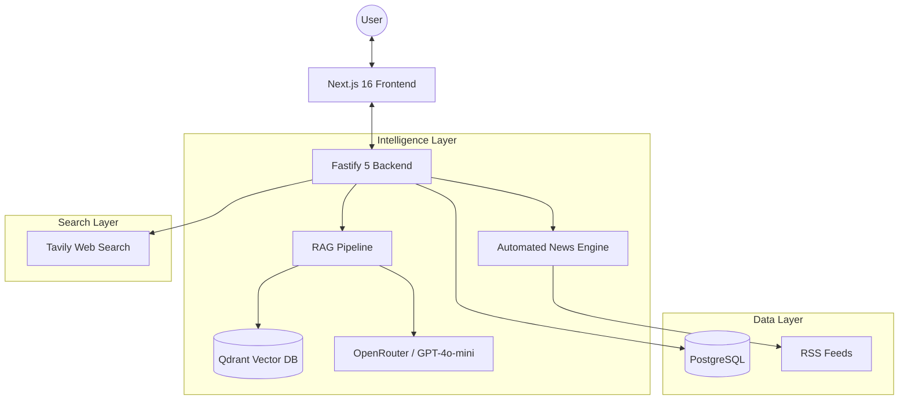

# 🎓 CampusAI: The Ultimate College Intelligence Engine

[](https://next.js.org)
[](https://fastify.io)
[](https://qdrant.tech)
[](LICENSE)

**CampusAI** is a high-performance, full-stack AI platform designed to revolutionize college research. By combining Retrieval-Augmented Generation (RAG), live web search, real-time news ingestion, and a comprehensive institutional database, CampusAI provides students with instant, accurate, and cited answers to complex academic queries.

---

## ✨ Key Features

### 🤖 Intelligent Chat Assistant
- **PDF Intelligence Mode**: Upload brochures or program guides to ask specific questions with 3-tier OCR fallback (PDF.js, pdf-parse, Tesseract.js).
- **Web Research Mode**: Integrated with **Tavily AI** for live, internet-scale research on admissions, placement stats, and rankings.
- **Compare Mode**: Side-by-side institutional analysis powered by LLM-driven comparison logic.
- **Source Citations**: Every claim is linked back to a specific document chunk or web URL.

### 📊 College Intelligence Dashboard
- **Rankings Engine**: Interactive dashboard for browsing and filtering colleges by state, city, and institutional type.
- **Location-Based Discovery**: Smart filtering to find top colleges in specific regions (e.g., Delhi, Mumbai).
- **Deep Metadata**: Access detailed profiles including NIRF rankings, facilities, and academic strengths.

### 📰 Automated News Pipeline
- **Real-time Ingestion**: Automated RSS scraping from top educational news sources.
- **AI Categorization**: News is automatically classified and indexed into the vector database for RAG-based retrieval.
- **Interactive News Feed**: A sleek, card-based interface to stay updated on admissions cycles and exam dates.

### 🛡️ Enterprise-Grade Guardrails
- **Input Security**: Prompt injection detection, PII scrubbing (Aadhaar, SSN, Emails), and domain enforcement.
- **Output Quality**: Hallucination detection, profanity filtering, and low-confidence annotations.
- **Rate Limiting**: Sliding-window IP-based protection (20 req/min).

---

## 🏗 Architecture



---

## 🛠 Tech Stack

| Component | Technology |
|---|---|
| **Frontend** | Next.js 16 (App Router), React 19, TypeScript, TailwindCSS 4 |
| **Animation** | Framer Motion, tsParticles |
| **Backend** | Fastify 5, Node.js, TypeScript |
| **Vector DB** | Qdrant (Hybrid Dense/Sparse Search) |
| **Database** | PostgreSQL |
| **LLM Gateway** | OpenRouter (GPT-4o-mini, Text-Embedding-3-Small) |
| **Search API** | Tavily AI |
| **OCR/Parsing** | Tesseract.js, PDF.js |

---

## 🚀 Quick Start

### Prerequisites
- Node.js ≥ 18
- Docker (for Qdrant & PostgreSQL)
- API Keys: OpenRouter, Tavily

### Setup & Installation

1. **Clone & Install**
   ```bash
   git clone https://github.com/yourusername/campus-ai.git
   cd campus-ai
   npm install --workspaces
   ```

2. **Database Setup**
   ```bash
   docker run -d -p 6333:6333 qdrant/qdrant
   docker run -d -p 5432:5432 -e POSTGRES_PASSWORD=postgres postgres
   ```

3. **Configuration**
   - Copy `server/.env.example` to `server/.env` and fill in your keys.
   - Copy `web/.env.example` to `web/.env.local`.

4. **Run Development**
   ```bash
   # Run both frontend and backend concurrently
   npm run dev --workspaces
   ```

---

## 🌍 Deployment
 
 ### Frontend (Vercel)
- **Framework**: Next.js (App Router)
- **Root Directory**: `web`
- **Build Command**: `next build`
- **Environment Variables**: Set `NEXT_PUBLIC_API_URL` to your Render backend URL.
 
 ### Backend (Render)
- **Option A: Web Service (Node)**
  - **Environment**: Node.js
  - **Root Directory**: `server`
  - **Build Command**: `npm install && npm run build`
  - **Start Command**: `npm run start`
  - **Health Check Path**: `/health`
- **Option B: Docker (Recommended)**
  - **Environment**: Docker
  - **Dockerfile Path**: `server/Dockerfile`
  - **Health Check Path**: `/health`

---

## 🐳 Docker Setup

For a full-stack local production environment:

1. **Configure Environment**: Create a root `.env` file based on `example.env`.
2. **Launch Services**:
   ```bash
   docker-compose up --build
   ```
   This will start:
   - **Frontend**: `http://localhost:3000`
   - **Backend**: `http://localhost:4000`
   - **Health API**: `http://localhost:4000/health`

---

## 🛡️ Production Readiness

The application is reinforced with:
- **Security**: `fastify-helmet` headers and Zod-based environment validation.
- **Observability**: Structured JSON logging via `pino` (standard in backend).
- **Stability**: Graceful shutdown handling and React Error Boundaries.
- **Performance**: Multi-stage Docker builds for minimal footprint.

---

## 📄 License
Distributed under the MIT License. See `LICENSE` for more information.

---

## 🙏 Credits
- **LLM Support**: OpenRouter
- **Search Capabilities**: Tavily AI
- **Vector Search**: Qdrant
- **UI Inspiration**: Modern Dashboard Aesthetics
